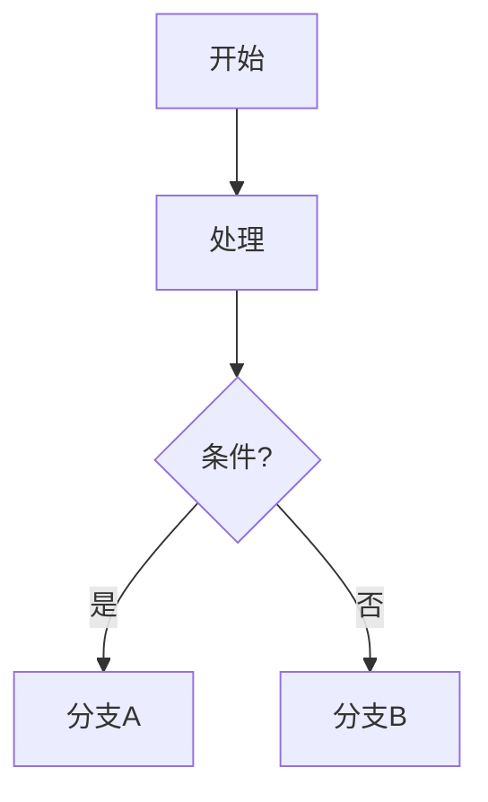

# 写作指南

## 新建文章（Post）

1. 在 `src/content/posts/` 创建 `.mdx` 文件，例如 `my-new-post.mdx`
2. 文件名即 slug（去掉空格，用连字符分隔）

### Frontmatter

```yaml
---
title: "文章标题"
description: "简要描述，用于首页列表和 SEO"
date: 2026-05-26
updated: 2026-05-26   # 可选
category: "技术"       # 必须与已有分类一致，或新分类
tags:                  # 可选，用于标签页聚合
  - ai
  - workflow
draft: false           # draft: true 的文章不会发布
slug: "my-new-post"    # URL 路径，建议与文件名一致
series: "ai-workflow"          # 可选，系列标识 slug。同系列文章用相同 series 值
seriesOrder: 1                 # 可选，系列内的序号 (1-indexed)
---
```

### 编写内容

从 `## 标题` 开始。支持标准 Markdown：

- 标题 `##` / `###`
- 列表 `-` / `1.`
- 代码块 ` ``` ` （自动高亮 + 复制按钮）
- 引用 `>`
- 链接 `[text](url)`

不要在第一行重复文章标题——页面自动渲染。

---

## 新建碎念（Note）

1. 在 `src/content/notes/` 创建 `.mdx` 文件，例如 `thinking-about-agents.mdx`
2. 文件名即 slug

### Frontmatter

```yaml
---
title: "思考：AI Agent 的上下文管理"  # 可选，无标题时显示"无标题碎念"
description: "一些零散想法"           # 可选
date: 2026-05-26
updated: 2026-05-26                   # 可选
tags:                                 # 可选
  - ai
  - workflow
draft: false
slug: "thinking-about-agents"
pinned: false                         # 置顶到碎念列表顶部
mood: "🤔"                            # 可选，显示在详情页日期旁
---
```

### 编写内容

碎念不需要完整文章结构，可以是一段话、几个要点、一张截图说明。

无标题碎念：不填 `title` 字段，正文第一行不会重复显示。

### 碎念约定

- 碎念是短内容，建议控制在 500 字以内。
- 比正式文章更随意，但 `draft: true` 仍生效。
- 每条碎念都有独立详情页 `/notes/<slug>` 和 Reaction 按钮。
- 主 RSS `/rss.xml` 只输出正式文章；碎念不会混入。
- 每条碎念详情页底部有"分享到 X"按钮，点击弹出 `intent/tweet` 新窗口，无需 API key。

---

## 新建系列（Series）

系列文章通过 `series` 和 `seriesOrder` 字段组织：

1. 在系列中第一篇文章的 frontmatter 加上 `series: "your-series-slug"` 和 `seriesOrder: 1`
2. 后续文章使用相同的 `series` 值，递增 `seriesOrder`
3. 在 `src/lib/series-config.ts` 中添加系列的中文名称和描述（key 为 series slug）

```ts
// src/lib/series-config.ts
export function getSeriesConfig(slug: string) {
  const map: Record<string, { name: string; description: string }> = {
    'ai-workflow': { name: 'AI 工作流', description: '探索 AI 辅助开发的完整工作流' },
    // 在此添加新系列...
  };
  return map[slug] ?? null;
}
```

系列功能：
- `/series` 列出所有系列
- `/series/<slug>` 展示系列详情、文章列表和进度
- 系列内文章详情页自动显示"第 N 篇 / 共 M 篇"进度条和上一篇/下一篇导航

---

## 新建 Garden 条目

Garden（知识库）用于长期维护的概念卡片和技术要点，以网状方式组织。

1. 在 `src/content/garden/` 创建 `.mdx` 文件，文件名即 slug

### Frontmatter

```yaml
---
title: "Swift 并发陷阱"
description: "Swift 6 并发模型中的常见误解与正确用法"
category: "Swift/Apple"   # 自由标签，用于分组
tags:                      # 可选
  - swift
  - concurrency
stage: budding             # seedling(嫩芽) | budding(生长中) | evergreen(长青)
related:                   # 可选，手动关联的其他 Garden 条目 slug
  - swift-concurrency-pitfalls
date: 2026-05-26
updated: 2026-05-26        # 可选
draft: false
---
```

### Wiki 链接

正文中可以用 `[[slug]]` 双括号语法引用其他 Garden 条目：

```mdx
参见 [[swift-concurrency-pitfalls]] 了解更详细的讨论。
```

- 已知 slug → 可点击链接跳转到 `/garden/<slug>`
- 未知 slug → 显示为灰色虚线，提示该条目尚未创建
- 每个条目底部自动显示"哪些页面引用了本文"（backlinks）

### Stage 说明

| stage | emoji | 中文 | 含义 |
|-------|-------|------|------|
| `seedling` | 🌱 | 嫩芽 | 初始想法，内容还不完整 |
| `budding` | 🌿 | 生长中 | 内容在持续完善中 |
| `evergreen` | 🌳 | 长青 | 内容成熟稳定，长期维护 |

---

## 代码块增强

### 文件名提示

在代码块的 fence marker 后添加 `title="文件名"` 即可显示文件名标签：

````md
```ts title="src/lib/content-helpers.ts"
export function getSeriesList() { ... }
```
````

### Diff 高亮

使用 `diff` 语言标签，行首 `+` 会高亮为绿色（新增），`-` 为红色（删除）：

````md
```diff
- import { oldFunction } from './old-module';
+ import { newFunction } from './new-module';
```
````

或与其他语言组合：` ```ts diff `。

### Mermaid 图表

正文中用 ` ```mermaid ` 代码块即可渲染 Mermaid 图表：

````md

````

支持流程图（graph）、时序图（sequence）、类图（class）等标准 Mermaid 图表类型。图表在客户端渲染，不影响首屏加载速度。

### 图片 Lightbox

文章中所有 Markdown `` 或 HTML `` 图片点击后自动弹出 lightbox 查看大图。按 Escape 或点击背景关闭。无需任何额外配置。

---

## 新建时间线事件（Timeline）

1. 在 `src/content/timeline/` 创建 `.mdx` 文件

### Frontmatter

```yaml
---
title: "博客二期上线"
description: "Notes / Timeline / Projects 增强 / Reaction 全部完成"  # 可选
date: 2026-05-26
type: milestone         # post | note | project | milestone | life
url: ""                 # 可选，如 "/notes/phase2-start"
tags:                   # 可选
  - blog
draft: false
---
```

### 类型说明

| type | 说明 | 使用场景 |
|------|------|----------|
| `milestone` | 通用里程碑 | 站点上线、版本发布、大型重构 |
| `life` | 生活事件 | 不是项目/文章/碎念，但有纪念意义 |
| `post` | 文章 | 一般不需要手动创建，Timeline 自动聚合 |
| `note` | 碎念 | 同上 |
| `project` | 项目 | 同上 |

时间线页面自动聚合源内容（posts、notes、projects），手动 `timeline` events 用于补充无法归属的里程碑。

### 编写内容

正文可选，可以用一句话说明事件背景。

---

## 维护项目详情（Project）

现有项目内容在 `src/content/projects/`。

### Frontmatter

```yaml
---
name: "项目名称"
description: "简短描述，用于列表卡片"
repo: "https://github.com/..."     # 可选
demo: "https://..."                 # 可选
tags: ["AI", "tool"]               # 可选
featured: true                     # 首页精选展示
status: active                     # active | planned | archived
slug: "my-project"                 # URL 路径，不填则用文件名
date: 2026-05-26                   # 项目起始日期
updated: 2026-05-26                # 最后更新
stack: ["Swift", "SwiftUI"]        # 技术栈
role: "独立开发"                    # 角色
links:                             # 额外链接
  - label: "文档"
    href: "https://docs.example.com"
weight: 10                         # 排序权重，越大越前
---
```

### 编写内容

项目详情页支持完整 MDX 正文：项目背景、架构说明、截图、维护状态等。

---

## 订阅方式

站点的订阅方式基于 RSS：

### 哪些内容可以订阅

- `src/content/posts/` 中的正式文章会自动出现在 `/rss.xml` 中。
- 碎念有独立的 RSS feed `/notes.xml`。
- 读者可以通过 `/newsletter` 页面找到 RSS 订阅链接和推荐的阅读器（NetNewsWire / Reeder / Feedly / Inoreader）。

### 订阅入口

- 站点 `/newsletter` 页面提供两个 RSS feed 链接和阅读器推荐。
- 无需任何外部依赖或 API key，纯静态功能。

---

## 本地预览

```bash
npm run dev
```

打开 http://localhost:4321 ，修改 markdown 后自动刷新。

## 发布

```bash
# 构建（含 Pagefind 索引）
npm run build

# 部署到 Cloudflare Pages
npm run deploy:cf
# 或
npx wrangler pages deploy dist --project-name mitoromisaka-blog

# 提交代码
git add -A
git commit -m "feat: new post <标题>"
git push
```

注意：Node 版本需要 >= 22.12。如果系统默认版本较低：

```bash
PATH=/opt/homebrew/opt/node@22/bin:$PATH npm run build
```
