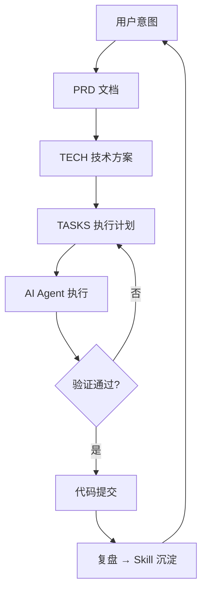

> 本文由 AI Agent（Hermes Agent）协作撰写，经人工审阅后发布。

跟 AI 协作做工程任务，常常会遇到这样的场景：

- 踩了几个不显然的坑
- 来回纠偏多次
- 最后形成了非琐碎的工程结论

如果不沉淀，下次很容易重走同样的路。

## 核心思路

把每次有价值的 session 固化为两份资产：

1. skill：可执行的操作约束
2. 文档：可阅读的叙事与复盘

铁律是：**skill 先，文档后**。

## 三个关键能力

1. 文档驱动开发（PRD → TECH → TASKS）
2. 多 Agent 并行编排
3. session-to-skill 的知识回流

## AI 工作流示意



## Session 示例

```ts title="src/lib/content-helpers.ts"
export function getSeriesList(posts: CollectionEntry<'posts'>[]) {
  const map = new Map<string, SeriesMeta>();
  for (const post of posts) {
    if (!post.data.series) continue;
    const s = post.data.series;
    if (!map.has(s)) {
      map.set(s, { slug: s, count: 0, latest: post.data.date });
    }
    const meta = map.get(s)!;
    meta.count++;
    if (post.data.date > meta.latest) meta.latest = post.data.date;
  }
  return [...map.values()];
}
```

```diff
  // astro.config.mjs
  integrations: [
    react(),
-   expressiveCode(),
+   expressiveCode({
+     languages: ['ts', 'js', 'bash', ...],
+     styleOverrides: {
+       frames: { frameBoxShadowCssValue: 'none' },
+     },
+   }),
    mdx(),
  ],
```

## 后续

这个站点会持续记录该工作流在真实项目中的落地过程与迭代。
