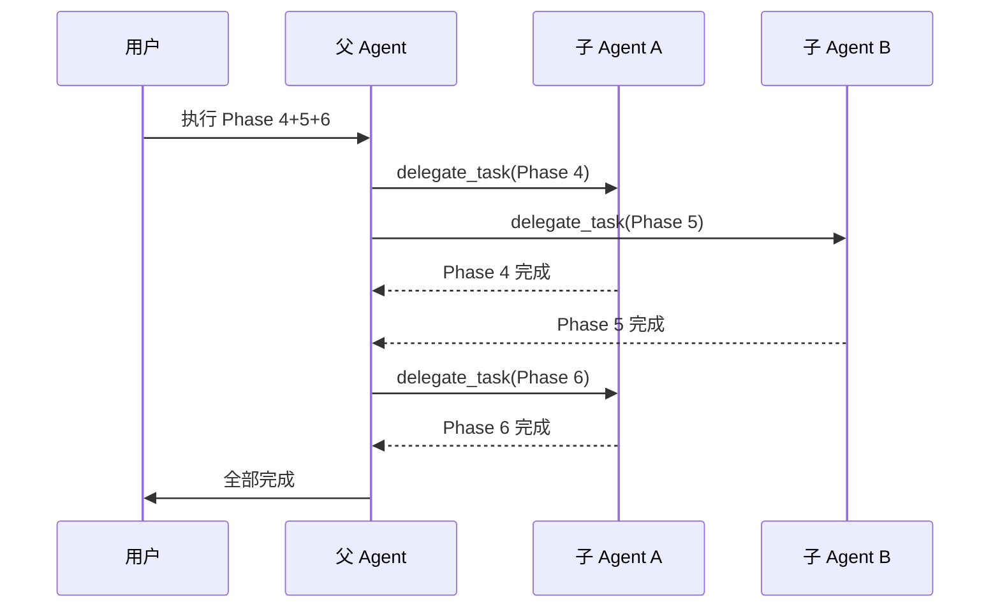

> 本文由 AI Agent（Hermes Agent）协作撰写，经人工审阅后发布。

上一篇介绍了文档驱动开发的完整工作流。这一篇深入 Hermes Agent 的工具链，看看具体如何落地。

## 核心工具


Hermes Agent 提供以下核心工具：

| 工具 | 用途 |
|------|------|
| `delegate_task` | 分发任务给子 agent，并行执行 |
| `cronjob` | 定时任务调度，可设间隔或 cron 表达式 |
| `terminal` | 执行 shell 命令，支持后台运行 |
| `memory` | 持久化记忆，跨 session 共享事实 |
| `skill_manage` | 创建/更新/删除 skill，固化操作约束 |

## 并行编排



## 定时任务

```ts title="cronjob 创建示例"
// 每 30 分钟检查一次 API 余额
cronjob({
  action: "create",
  name: "cc-usage-check",
  schedule: "30m",
  prompt: "查询 Command Code API 余额并报告",
  toolsets: ["terminal", "web"],
});
```

## 关键差异对比

```diff
  // Phase 5 执行方式对比
- delegate_task(goal="Phase 5", ...)
+ delegate_task(goal="Phase 5", ...,
+   context="explicit instructions here",
+   toolsets=["terminal", "file"],
+ )
```

## 后续

下一篇将深入 Skill 系统的设计模式与最佳实践。
